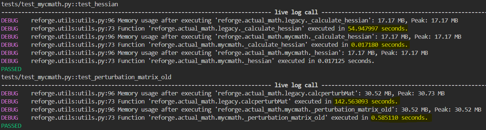

Why use reForge?
================

Working with large biomolecular complexes?
-------------------------------------------

reForge aims to simplify the setup process for coarse-grained or all-atom Protein/RNA/Lipid complexes, 
helping to streamline what can often be a complex workflow.

  .. image:: img/reforge_ribosome.png
     :alt: reForge Ribosome
     :scale: 50 %

Python-Based
------------

reForge is built in *Python*, designed to be accessible and easy to integrate into existing workflows.

- **Streamlined Workflows:**  
  Python scripts help automate repetitive tasks. Whether managing a few or many MD simulations, 
  reForge aims to reduce manual setup overhead.

Accelerated C- and CUDA Routines
--------------------------------

- **Performance Optimization:**  
  Utilizes C and CUDA acceleration to improve processing speeds for large datasets 
  compared to standard Python implementations.

Performance improvements can be particularly beneficial for medium to large systems 
(~1000+ residues) and when scaling to multiple systems.

Tools for Custom Model Development
------------------------------------

Provides utilities to help develop custom models and integrate them with existing MD engines and analysis tools.

.. image:: img/reforge_dsrna.png
   :alt: reForge dsRNA
   :scale: 30 %

For New Users
-------------

- **Learning Resources:**  
  Tutorials and examples are included to help users get started with basic workflows and understand 
  the package's capabilities.

Indices and Tables
------------------

* :ref:`genindex`
* :ref:`modindex`
* :ref:`search`

